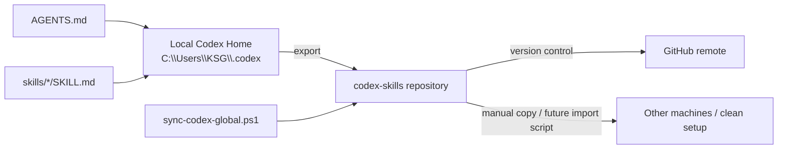

# Codex Skills

Personal Codex skills repository for backing up, organizing, and synchronizing reusable `SKILL.md`-based agent workflows.

This repository is not an application project. It is a portable knowledge and workflow layer for Codex: global agent constraints, task-specific skills, engineering playbooks, automation scripts, and supporting materials.

## What this repository contains

- `AGENTS.md` — global Codex execution contract and user-facing collaboration rules.
- `sync-codex-global.ps1` — Windows PowerShell export script for syncing local Codex global config into this repository.
- Skill directories — each skill defines a reusable workflow through `SKILL.md`.
- Optional resources — selected skills include `agents/`, `assets/`, `references/`, `scripts/`, `templates/`, or `themes/`.

## Current repository shape

```text
.
├── AGENTS.md
├── LICENSE
├── README.md
├── sync-codex-global.ps1
├── <skill-name>/
│   └── SKILL.md
├── oh-my-mermaid/
│   ├── omm-push/
│   │   └── SKILL.md
│   ├── omm-scan/
│   │   └── SKILL.md
│   └── omm-view/
│       └── SKILL.md
└── ...
```

The normal skill entry is a directory containing `SKILL.md`. Some directories are skill groups, such as `oh-my-mermaid/`, which contains multiple nested skills.

## Operating model



The repository is designed around one primary direction:

```text
C:\Users\KSG\.codex  ->  this repository  ->  GitHub
```

It is primarily an export and backup repository. There is currently no dedicated import script in the repository.

## Skill index

| Skill | Purpose | Extra resources | License note |
| --- | --- | --- | --- |
| `algorithmic-art` | Create generative art with p5.js, random seeds, and interactive parameters. | `templates/` | Skill-level license |
| `api-and-interface-design` | Design stable APIs, module boundaries, and public interfaces. | - | Repository license |
| `brand-guidelines` | Apply Anthropic-style brand color, typography, and visual rules to artifacts. | - | Skill-level license |
| `browser-testing-with-devtools` | Test, inspect, and debug pages in a real browser. | - | Repository license |
| `canvas-design` | Create PNG, PDF, poster, and static visual design outputs. | - | Skill-level license |
| `ci-cd-and-automation` | Design and maintain CI/CD pipelines and automation workflows. | - | Repository license |
| `code-comment` | Generate, edit, review, and document code with Chinese comment conventions. | `references/` | Repository license |
| `code-review-and-quality` | Review code from defect, quality, risk, and testability perspectives. | - | Repository license |
| `code-simplification` | Simplify code structure and improve maintainability. | - | Repository license |
| `context-engineering` | Optimize agent context layout, evidence selection, and task input packaging. | - | Repository license |
| `debugging-and-error-recovery` | Diagnose root causes and recover from broken states systematically. | - | Repository license |
| `deprecation-and-migration` | Manage deprecation, migration, compatibility, and transition plans. | - | Repository license |
| `documentation-and-adrs` | Write project documentation, ADRs, background notes, and engineering records. | - | Repository license |
| `encoding-guardian` | Protect and recover mixed-encoding files such as GBK, ANSI, UTF-8-BOM, and UTF-16. | `agents/`, `scripts/` | Repository license |
| `frontend-design` | Create production-grade frontend interfaces with strong visual quality. | - | Skill-level license |
| `frontend-ui-engineering` | Build production-quality UI state, components, interactions, and integration logic. | - | Repository license |
| `git-workflow-and-versioning` | Organize branches, commits, versioning, diffs, and collaboration workflow. | - | Repository license |
| `hatch-pet` | Create, repair, validate, preview, and package Codex-compatible animated pet spritesheets. | `scripts/`, generated QA flow | Repository / skill materials |
| `idea-refine` | Refine ideas through divergent and convergent thinking. | `scripts/` | Repository license |
| `incremental-implementation` | Split implementation into small, reversible, verifiable steps. | - | Repository license |
| `pdf` | Read, create, or review PDFs that require rendering and layout judgment. | `agents/`, `assets/` | Skill-level license |
| `performance-optimization` | Locate and optimize performance bottlenecks, load time, and key metrics. | - | Repository license |
| `planning-and-task-breakdown` | Break specifications or requirements into ordered, executable tasks. | - | Repository license |
| `playwright` | Use a real browser for navigation, form actions, screenshots, extraction, and UI debugging. | `agents/`, `assets/`, `references/`, `scripts/` | Skill-level license |
| `rdc-cli` | Analyze RenderDoc `.rdc` captures, draw calls, pipeline state, shaders, resources, and render targets. | `agents/`, `references/` | Repository license |
| `security-and-hardening` | Harden inputs, authentication, storage, dependency use, and external integration surfaces. | - | Repository license |
| `shipping-and-launch` | Prepare release, rollout, monitoring, rollback, and launch readiness. | - | Repository license |
| `source-driven-development` | Ground implementation decisions in official documentation and authoritative sources. | - | Repository license |
| `spec-driven-development` | Clarify specifications, requirements, and acceptance criteria before coding. | - | Repository license |
| `svn-workflow` | Handle status, diff, commit, conflict, and hybrid Git/SVN repository workflows. | `agents/` | Repository license |
| `test-driven-development` | Drive implementation and bug fixes through tests. | - | Repository license |
| `theme-factory` | Apply reusable theme systems to slides, documents, reports, and HTML artifacts. | `themes/` | Skill-level license |
| `using-agent-skills` | Discover, select, and invoke the appropriate agent skill for a task. | - | Repository license |
| `vibe-kanban-agent-protocol` | Define Vibe Kanban multi-agent task relationships, workspaces, and integration rules. | `agents/`, `references/` | Repository license |
| `web-artifacts-builder` | Build complex HTML artifacts with modern frontend technology. | `scripts/` | Skill-level license |

### Nested oh-my-mermaid skills

| Skill | Purpose |
| --- | --- |
| `oh-my-mermaid/omm-scan` | Scan a codebase and generate or update `.omm/` architecture documentation through perspective-based recursive analysis. |
| `oh-my-mermaid/omm-view` | Start the local oh-my-mermaid web viewer for `.omm/` architecture diagrams. |
| `oh-my-mermaid/omm-push` | Push `.omm/` architecture documentation to oh-my-mermaid cloud, including login, link, and push workflow handling. |

## Usage

Codex discovers local skills from the global skills directory:

```text
C:\Users\KSG\.codex\skills
```

To enable a skill globally, place the complete skill directory under that path.

Example: copy one skill from this repository into the local Codex skills directory.

```powershell
Copy-Item -LiteralPath ".\rdc-cli" -Destination "$env:USERPROFILE\.codex\skills\rdc-cli" -Recurse -Force
```

One-line version:

```powershell
Copy-Item -LiteralPath ".\rdc-cli" -Destination "$env:USERPROFILE\.codex\skills\rdc-cli" -Recurse -Force
```

For a grouped skill such as `oh-my-mermaid`, keep its nested structure intact.

```powershell
Copy-Item -LiteralPath ".\oh-my-mermaid" -Destination "$env:USERPROFILE\.codex\skills\oh-my-mermaid" -Recurse -Force
```

One-line version:

```powershell
Copy-Item -LiteralPath ".\oh-my-mermaid" -Destination "$env:USERPROFILE\.codex\skills\oh-my-mermaid" -Recurse -Force
```

## Sync script

`sync-codex-global.ps1` exports the current global Codex configuration into this repository.

It performs these actions:

1. Reads global `AGENTS.md` from:
   - `C:\Users\KSG\.codex\AGENTS.md`
   - fallback: `C:\Users\KSG\AGENTS.md`
2. Reads installed skills from:
   - `C:\Users\KSG\.codex\skills`
3. Preserves only:
   - `.git`
   - `.gitignore`
   - `LICENSE`
   - `README.md`
   - `sync-codex-global.ps1`
4. Removes other repository entries before copying the current global skills.
5. Stages and commits the result.
6. Pushes to the remote default branch unless `-SkipPush` is used.

> Warning: the script currently uses a force push when pushing to the remote default branch. Use `-WhatIf` first, and use `-SkipPush` when you want a local commit only.

### Preview without changing files

```powershell
pwsh -NoProfile -ExecutionPolicy Bypass -File .\sync-codex-global.ps1 -WhatIf
```

One-line version:

```powershell
pwsh -NoProfile -ExecutionPolicy Bypass -File .\sync-codex-global.ps1 -WhatIf
```

### Export and commit locally, without pushing

```powershell
pwsh -NoProfile -ExecutionPolicy Bypass -File .\sync-codex-global.ps1 -SkipPush
```

One-line version:

```powershell
pwsh -NoProfile -ExecutionPolicy Bypass -File .\sync-codex-global.ps1 -SkipPush
```

### Export, commit, and push

```powershell
pwsh -NoProfile -ExecutionPolicy Bypass -File .\sync-codex-global.ps1
```

One-line version:

```powershell
pwsh -NoProfile -ExecutionPolicy Bypass -File .\sync-codex-global.ps1
```

## Maintenance rules

When adding or updating skills:

1. Keep each skill self-contained.
2. Add or update `SKILL.md`.
3. Keep the trigger conditions, workflow, inputs, outputs, and constraints explicit.
4. Preserve supporting resources under the skill directory.
5. Keep third-party license files inside the relevant skill directory when needed.
6. Update the skill index in this README.
7. Run the sync script from a clean working tree when exporting from local Codex global config.

Suggested check before committing:

```powershell
git status --short
```

One-line version:

```powershell
git status --short
```

## Safety notes

- Do not commit local secrets, tokens, API keys, private endpoints, cookies, or machine-specific credentials.
- Treat `AGENTS.md` as an executable operating contract for agents, not as ordinary prose.
- Treat every `SKILL.md` as behavior-affecting configuration.
- Review generated or imported skills before syncing them to GitHub.
- Prefer `-WhatIf` before any destructive sync.
- Prefer `-SkipPush` when testing a sync change.

## License

Repository-level license is defined in `LICENSE`.

Some skills may contain independent `LICENSE.txt` files or embedded license notes. For those directories, the skill-level license takes precedence for that skill’s bundled materials.
